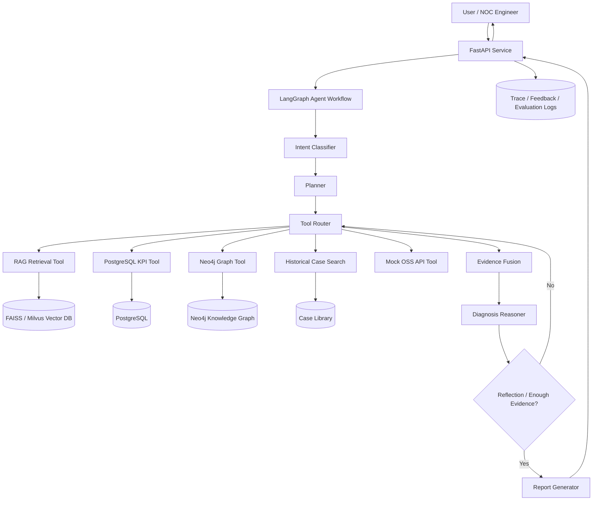

# TelecomOps-Agent

> A production-style, privacy-safe demo of a telecom operations diagnosis agent built with **LangGraph + GraphRAG + RAG + SQL Tooling**.

## 1. Project Positioning

`TelecomOps-Agent` is an open-source, desensitized engineering demo for telecom network operations.  
It simulates a real wireless network troubleshooting workflow:

```text
故障现象 → KPI 查询 → 告警检索 → 知识图谱多跳推理 → 相似案例检索 → 排查步骤 → 运维报告
```

The goal is not to build a toy chatbot, but to demonstrate how an LLM Agent can be used in an enterprise scenario with:

- stateful workflow orchestration
- tool routing
- structured data querying
- knowledge graph reasoning
- evidence-grounded diagnosis
- report generation
- evaluation and feedback loop

## 2. Core Scenario

Example user query:

> Site SZ-NANSHAN-023 has a sudden RSRP drop and increasing call drop rate during the last 2 hours. Please analyze possible causes and give troubleshooting steps.

Expected output:

```text
1. Observed symptoms
   - RSRP decreased from -88 dBm to -106 dBm.
   - Call drop rate increased from 0.6% to 3.8%.
   - Related alarm: VSWR_HIGH on Cell-2.

2. Possible root causes
   - Antenna feeder issue.
   - Power amplifier abnormality.
   - Recent parameter change causing coverage degradation.

3. Recommended troubleshooting steps
   - Check current alarms and VSWR values.
   - Compare KPI trends before and after parameter changes.
   - Verify neighboring cell handover success rate.
   - Dispatch field engineer if hardware alarm persists.

4. Confidence
   - High, because KPI trend, alarm, and historical case evidence are consistent.
```

## 3. System Architecture



## 4. Main Features

### 4.1 Multi-tool Agent

The agent can call different tools according to the problem type:

| Tool | Purpose |
|---|---|
| RAG Retrieval Tool | Retrieve troubleshooting documents, SOPs, and manuals |
| PostgreSQL KPI Tool | Query structured KPI data such as RSRP, SINR, PRB utilization, drop rate |
| Neo4j Graph Tool | Perform multi-hop reasoning over site, cell, KPI, alarm, root cause, and action |
| Case Search Tool | Retrieve similar historical fault cases |
| Mock OSS API Tool | Simulate external operation support system calls |
| Report Generator | Generate structured diagnosis report |

### 4.2 LangGraph Workflow

The workflow is implemented as a state machine, not a single prompt chain.

Key nodes:

```text
input_guard → intent_classifier → entity_extractor → planner → tool_router
→ rag_retriever / sql_query / graph_query / case_search
→ evidence_fusion → diagnosis_reasoner → reflection → report_generator
```

### 4.3 GraphRAG Reasoning

The Neo4j graph models telecom entities and their relationships:

```text
Site → Cell → KPI → FaultMode → RootCause → Action
```

This enables multi-hop reasoning such as:

```text
RSRP_DROP + VSWR_HIGH + Recent Parameter Change
→ possible root cause: feeder/antenna issue or incorrect tilt/power setting
→ recommended action: check feeder, rollback parameter, verify neighbor handover
```

### 4.4 Evaluation

Planned evaluation metrics:

| Metric | Meaning |
|---|---|
| Tool Accuracy | Whether the agent selected the correct tool |
| Evidence Recall | Whether relevant evidence was retrieved |
| Faithfulness | Whether the answer is grounded in retrieved evidence |
| Task Success Rate | Whether the final diagnosis solves the user request |
| Latency | End-to-end response time |
| Human Feedback Score | Operator rating for final report |

## 5. Repository Structure

```text
telecomops-agent/
├── README.md
├── .env.example
├── docker-compose.yml
├── requirements.txt
├── configs/
│   ├── app.yaml
│   ├── model.yaml
│   └── prompts.yaml
├── data/
│   ├── mock_kpi/
│   ├── mock_alarms/
│   ├── documents/
│   └── cases/
├── docs/
│   ├── architecture.mmd
│   ├── langgraph_workflow_design.md
│   ├── postgres_schema.sql
│   ├── neo4j_schema.md
│   ├── api_design.md
│   └── resume_project_description.md
├── src/
│   └── telecomops_agent/
│       ├── api/
│       │   ├── main.py
│       │   ├── routes.py
│       │   └── schemas.py
│       ├── agent/
│       │   ├── state.py
│       │   ├── graph.py
│       │   ├── nodes.py
│       │   └── prompts.py
│       ├── tools/
│       │   ├── rag_tool.py
│       │   ├── sql_tool.py
│       │   ├── graph_tool.py
│       │   ├── case_tool.py
│       │   └── report_tool.py
│       ├── retrievers/
│       ├── db/
│       ├── evaluation/
│       └── utils/
├── tests/
│   ├── test_agent_graph.py
│   ├── test_sql_tool.py
│   ├── test_graph_tool.py
│   └── test_api.py
└── scripts/
    ├── init_postgres.py
    ├── init_neo4j.py
    ├── ingest_docs.py
    ├── generate_mock_data.py
    └── run_eval.py
```

## 6. Quick Start

### 6.1 Create environment

```bash
conda create -n telecomops-agent python=3.10 -y
conda activate telecomops-agent
pip install -r requirements.txt
```

### 6.2 Start dependencies

```bash
docker compose up -d postgres neo4j
```

### 6.3 Initialize mock data

```bash
python scripts/generate_mock_data.py
python scripts/init_postgres.py
python scripts/init_neo4j.py
python scripts/ingest_docs.py
```

### 6.4 Run API

```bash
uvicorn src.telecomops_agent.api.main:app --host 0.0.0.0 --port 8000 --reload
```

### 6.5 Test diagnosis endpoint

```bash
curl -X POST "http://localhost:8000/api/v1/diagnose" \
  -H "Content-Type: application/json" \
  -d '{
    "query": "Cell SZ-NS-023-2 has RSRP drop and high call drop rate in the last 2 hours. Please diagnose.",
    "site_id": "SZ-NS-023",
    "cell_id": "SZ-NS-023-2",
    "time_range": {
      "start": "2026-05-01T10:00:00",
      "end": "2026-05-01T12:00:00"
    }
  }'
```

## 7. MVP Milestones

### Day 1-2

- Set up project structure.
- Implement FastAPI skeleton.
- Implement LangGraph state and basic workflow.
- Prepare mock KPI, alarm, and case data.

### Day 3-4

- Implement PostgreSQL SQL Tool.
- Implement Neo4j Graph Tool.
- Implement RAG retrieval tool.
- Add basic report generator.

### Day 5-6

- Connect tools into LangGraph.
- Add reflection and retry logic.
- Add Streamlit or simple web demo.

### Day 7

- Add evaluation dataset.
- Add README screenshots and demo examples.
- Polish GitHub repository.

## 8. Engineering Highlights for Interview

This project is designed to show the following capabilities:

1. **Agent workflow design**  
   The system uses LangGraph to explicitly model state transitions, instead of relying on a single long prompt.

2. **Enterprise data integration**  
   The agent integrates unstructured documents, structured KPI tables, and graph-based domain knowledge.

3. **Tool use and failure recovery**  
   The workflow supports tool routing, tool error capture, evidence sufficiency check, and reflection-based retry.

4. **GraphRAG reasoning**  
   The graph is used for multi-hop diagnosis from symptoms to root causes and operation actions.

5. **Evaluation mindset**  
   The project includes metrics for tool accuracy, evidence recall, faithfulness, task success rate, and latency.

## 9. Roadmap

- [ ] Add streaming response.
- [ ] Add LangSmith / OpenTelemetry tracing.
- [ ] Add RAGAS-based answer evaluation.
- [ ] Add mock OSS API integration.
- [ ] Add SQL query validation and sandbox execution.
- [ ] Add role-based access control.
- [ ] Add Docker one-click deployment.
- [ ] Add frontend dashboard.
